# MamaSafe AI — System Architecture

- **Document status:** v1.0 — 2026-08-11
- **Scope:** Platform architecture for MamaSafe AI (MVP: PPH workflow) and the shared AnesthesiaOS Africa platform layer that future modules plug into.
- **Companion documents:** `docs/PRD.md` (requirements), `docs/API_CONTRACTS.md` (engineering contracts), `docs/SAFETY.md` (safety architecture), `docs/ROADMAP.md` (module sequencing).
- **Regulatory position:** Development and simulation only. No FDA clearance, no CE marking, no clinical approval.

---

## 1. Architecture Overview

The system is organized as **three layers plus a cross-cutting safety & audit spine**. The governing principle, inherited from the AnesthesiaOS safety lineage:

> **Anything clinically consequential is computed by deterministic, version-controlled, source-linked rules. The generative AI layer handles language, retrieval, explanation, and documentation — and nothing else.**

```mermaid
flowchart TB
    subgraph UI["Presentation Layer — apps/web (Offline-first PWA)"]
        INTAKE[Intake UI<br/>structured form + free text/voice]
        CHECKLIST[Pathway Checklist UI<br/>confirm / defer / override]
        CALC[Dose & Fluid Display<br/>inputs + formula + citation]
        HANDOFF[Referral Note / SBAR / Read-back]
        AUDITVIEW[Audit Trail Viewer]
        SIM[Simulation Mode UI<br/>synthetic cases only]
    end

    subgraph SPINE["Safety & Audit Spine — packages/audit (cross-cutting)"]
        GATE[Human Confirmation Gates<br/>no consequential action without clinician tap]
        LABEL[Provenance Labeling<br/>RULE-BASED vs AI-GENERATED on every output]
        LOG[Hash-Chained Audit Log<br/>tamper-evident, version-stamped]
        VER[Version Stamps<br/>rules / pathway / model versions on every event]
    end

    subgraph CORE["Layer 1 — Deterministic Clinical Core — packages/clinical-core"]
        NORM[Intake Normalization & Validation]
        RISK[Risk Engine<br/>shock index, MEOWS-style scoring, tiers]
        MISSING[Missing Critical Info Detector]
        PATH[Pathway State Machines<br/>PPH now; preeclampsia/sepsis/etc. later]
        DOSE[Dosing & Fluid Calculator<br/>weight-based, contraindication-gated]
        ESC[Escalation & Referral Triggers]
        RULES[(Versioned Clinical Rule Data<br/>JSON + guideline citations)]
    end

    subgraph GEN["Layer 2 — Generative Layer — packages/ai-gateway"]
        GW[AI Gateway Interface]
        GEM[Gemini Adapter<br/>cloud: structuring, RAG QA, drafting, translation, narration]
        OFF[Offline Fallback Adapter<br/>templated, rule-derived text]
        GEMMA[Gemma Edge Adapter — future<br/>on-device language/retrieval]
        RAG[Source-linked RAG<br/>citations only from curated corpus]
    end

    subgraph DATA["Data Layer"]
        IDB[(IndexedDB — case state, audit queue, settings)]
        CACHE[(PWA Cache — app shell + versioned pathways)]
        SYNC[Deferred Sync Queue — future, consented]
    end

    INTAKE --> NORM
    NORM --> RISK --> PATH
    NORM --> MISSING
    PATH --> DOSE
    PATH --> ESC
    RISK -.->|re-assessment| ESC
    CORE -->|facts, never prose invention| GW
    GW --> GEM & OFF & GEMMA
    RAG --> GW
    CORE --> CHECKLIST & CALC & HANDOFF
    GW --> HANDOFF
    ALL[All components] --> SPINE
    SPINE --> LOG
    UI --> IDB
    RULES --> CACHE
    IDB --> SYNC
```

**Reading the diagram:** the UI talks to the deterministic core for everything consequential; the generative layer receives rule-derived *facts* and may only re-express them. Every output of every layer passes through the safety & audit spine before reaching the screen.

---

## 2. Layer 1 — Deterministic Clinical Core (`packages/clinical-core`)

**Role:** sole source of truth for doses, thresholds, contraindications, scoring, protocol sequencing, escalation criteria, and referral triggers.

**Properties (non-negotiable):**

- **Pure TypeScript, zero runtime dependencies.** Pure functions in, structured data out. No network, no clock dependence (timestamps injected), no randomness.
- **Data-driven rules.** Clinical rules live in versioned JSON pathway files (`packages/clinical-core/data/`), each entry carrying a guideline citation: organization, document title, year/version, section, date last reviewed. The engine refuses to emit an uncited clinical rule.
- **Fail-safe defaults.** Unknown or ambiguous inputs bias toward escalation and "missing information" prompts — never toward reassurance.
- **Fully unit-tested** (vitest), including synthetic adversarial cases (see `docs/SAFETY.md` §8).
- **Version-stamped.** Every assessment output carries `rulesVersion` and `pathwayVersion`, so any audit event can be replayed against the exact rules that produced it.

**Components:**

| Component | Responsibility |
|---|---|
| Intake normalization | Validate and normalize `IntakePayload`; unit discipline; reject implausible values with explicit reasons. |
| Risk engine | Shock index, MEOWS-style early-warning aggregation, risk-tier classification, red-flag extraction. |
| Missing-info detector | Deterministically enumerate decision-relevant absent fields with per-field rationale. |
| Pathway state machine | Ordered, prioritized PPH action checklist; gating, prerequisites, contraindication checks, re-prioritization on new observations. |
| Dosing & fluid calculator | Weight-based medication calculations (oxytocin, TXA, misoprostol, ergometrine with contraindication gate), fluid/transfusion guidance; always returns inputs + formula + citation for independent verification. |
| Escalation & referral triggers | `EscalationDecision` (urgency, reason codes, pending-transfer actions) and referral requirements (receiving-facility capabilities). |

## 3. Layer 2 — Generative Layer (`packages/ai-gateway`)

**Role:** language and language only — structuring narrative intake, explaining steps, drafting documentation, translating patient-facing text, narrating simulations, and retrieving from the curated guideline corpus.

**Hard boundary:** the generative layer **never computes** doses, thresholds, scores, contraindications, or escalation decisions, and **never adds clinical facts** to rule-derived content. When it re-expresses clinical facts, those facts arrive in its prompt as structured, rule-engine output and the contract requires it to preserve them verbatim.

**Adapters behind one interface (`AIGateway`, see `docs/API_CONTRACTS.md`):**

| Adapter | Purpose | Status |
|---|---|---|
| Gemini (cloud) | Intake structuring, guideline-grounded Q&A via RAG, SBAR/referral drafting, patient explanation, translation, simulation narration. | Gateway designed; live calls not wired into the demo path. |
| Offline fallback | Deterministic templated text assembled from rule-engine output. Guarantees the demo and any offline session lose no clinical content. Output is labeled `AI-GENERATED (offline template)` and is clinician-reviewable like any AI output. | Implemented contract for MVP. |
| Gemma (edge) | Future on-device language tasks for low-connectivity facilities and privacy-sensitive processing. | Exploration only. |

**Grounding rules:**

- RAG retrieval is restricted to a **curated, citation-complete corpus**. The model may only cite sources present in the corpus; the gateway validates citation strings against the corpus manifest and drops or flags anything unverifiable (fabricated-citation control).
- All generative output is stamped `AI-GENERATED`, carries the model/version identifier, and is routed through the safety spine before display.

## 4. The Safety & Audit Spine (`packages/audit`)

The spine is not a layer other components can bypass; every consequential transition passes through it.

1. **Provenance labeling.** Every rendered output is stamped `RULE-BASED`, `AI-GENERATED`, or `HYBRID` (rule-derived facts with AI-phrased language). The label is visible in the UI wherever the output appears.
2. **Human confirmation gates.** No consequential action (checklist completion, dose confirmation, escalation acknowledgment, referral-note finalization) takes effect without an explicit clinician interaction. Confirmation UI is designed to be *genuinely reviewable* (summary, read-back, derivation visible) — never a rubber-stamp dialog (automation-bias control; see `docs/SAFETY.md` §7).
3. **Tamper-evident audit log.** Hash-chained append-only log: each event includes the previous event's hash, so silent modification or deletion is detectable. Events carry actor, timestamp, payload summary, rules/pathway versions, and model version where applicable.
4. **Version & change control.** Rules data, pathway definitions, prompt templates, and model identifiers are versioned; every audit event records the versions in force.
5. **Manual override.** Always available, logged with a reason, and never disables future safety checks.

## 5. Offline-First PWA Design (`apps/web`)

| Concern | Design |
|---|---|
| App shell | Vite + React 18 + TypeScript + Tailwind; `vite-plugin-pwa` service worker precaches the shell. |
| Clinical content | Versioned pathway/rule JSON packaged with the app and cached; version stamp + staleness warning in UI. |
| Local state | IndexedDB (via `idb`) for case state, audit events, and settings; survives reload/restart. |
| Deferred sync | Outbox pattern: audit and (future, consented) analytics queue locally; sync when online; server-wins for clock, client-preserves for audit integrity (append-only; conflicts create linked events, never rewrites). |
| SMS fallback (concept) | Referral summary compressed into a structured, SMS-sized text block the clinician can send over basic GSM. Concept documented; post-MVP. |
| Device targets | Older Android browsers/WebView; low-memory profile; no heavy client frameworks beyond React; voice features degrade to text gracefully. |

**Simulation/clinical separation:** simulation mode is an architectural partition, not a visual toggle — separate state container, synthetic-data-only ingestion, persistent banner, and no pathway from simulation to any real-data store.

## 6. Data Governance

Designed for Nigerian data-protection requirements (Nigeria Data Protection Act 2023) and future cross-border expansion, even though the MVP uses synthetic data only.

| Control | Design |
|---|---|
| Encryption | TLS in transit (when sync exists); at-rest encryption of local stores on capable devices; key management deferred to deployment architecture. |
| Access | Role-based access model in contracts (`actor.role` on audit events); facility-scoped data model reserved in schema. |
| Minimum necessary | Intake schema deliberately excludes identifiers not needed for the emergency workflow; no names required to run a case. |
| Deidentification & consent | Research use requires deidentified extracts + documented consent flow; never automatic. |
| **Data separation** | Four logically separate stores: **clinical operations**, **analytics**, **research**, **model training**. Clinical data never flows into training automatically; a training export requires explicit governance action. |
| Provenance | Every datum carries origin metadata (device-entered, AI-structured, imported) in audit events. |

## 7. Shared Platform Services — How Future Modules Plug In

The founder's Phase 2–6 products (Pediatric Emergency, SickleSafe, MalariaShield, VaxReach, Africa Clinical Copilot) are **clinical packages on one platform**, not new apps. The platform exposes shared services; each module contributes data + pathway definitions + module-specific UI.

| Shared service | Contract surface | Reused by |
|---|---|---|
| Patient/case data model | `IntakePayload` family (core vitals + module extension fields) | All modules |
| Rule engine | Versioned pathway JSON + engine API (`assessIntake`, pathway state machines, `computeDoses`) | All modules (pediatric dosing reuses weight-based calculator with pediatric rule packs and stricter guardrails) |
| AI gateway | `AIGateway` interface (structure/explain/draft/translate/narrate) | All modules |
| Audit spine | `AuditEvent` + hash-chain append API | All modules |
| Localization layer | Locale resource structure + protected-token translation invariant | All modules |
| Offline engine | PWA caching, IndexedDB stores, deferred sync | All modules |
| Medication library | Versioned drug/dose data with citations | Maternal, pediatric, malaria modules |
| Referral engine | `ReferralNote`, `EscalationDecision`, receiving-capability model | All clinical modules |

**Module plug-in contract:** a new clinical module ships (a) rule/pathway JSON with citations, (b) intake extension schema, (c) checklist UI descriptors, (d) module tests including adversarial cases. It may not bypass the engine, the spine, or the localization invariants. MamaSafe's PPH pathway is the reference implementation of this contract.

## 8. Technology Stack (summary)

| Area | Choice | Rationale |
|---|---|---|
| Language | TypeScript everywhere | One type system across engine, gateway, app; contracts in `docs/API_CONTRACTS.md` compile. |
| Engine | Pure TS, zero deps, vitest | Verifiability, testability, offline packaging. |
| Frontend | Vite + React 18 + Tailwind + vite-plugin-pwa; IndexedDB via `idb` | Fast PWA, mature offline tooling, low-end device friendly. |
| AI | `@google/genai` (Gemini) behind `packages/ai-gateway`; templated offline fallback; Gemma exploration later | Google AI story with a guaranteed-safe degradation path. |
| Testing | vitest; clinical safety suite (synthetic + adversarial) | Safety evidence for every rule and guardrail. |
| Backend | None required for MVP; contracts define the future proxy/FHIR-shaped API | Demo runs entirely client-side, offline. |

## 9. Architectural Decision Records (condensed)

| ADR | Decision | Consequence |
|---|---|---|
| ADR-1 | Deterministic engine, not LLM, is source of truth for all consequential clinical values. | AI can never invent a dose; generative layer is replaceable without touching safety. |
| ADR-2 | Single `AIGateway` interface with mandatory offline fallback adapter. | Demo never depends on network/API key; graceful degradation is structural. |
| ADR-3 | Hash-chained audit log client-side, append-only. | Tamper evidence without a server; sync later preserves chain integrity. |
| ADR-4 | Provenance labels (`RULE-BASED`/`AI-GENERATED`) are required fields in contracts, not UI decoration. | Labeling cannot be forgotten; engineers get compile-time enforcement. |
| ADR-5 | Monorepo with platform packages (`clinical-core`, `audit`, `ai-gateway`) separate from clinical pathway data. | Phases 2–6 plug in without forking; PPH is the reference module. |
| ADR-6 | Synthetic data only in all development artifacts. | Zero patient-data exposure during development and demo. |

---

*Changes to this architecture require corresponding updates to `docs/API_CONTRACTS.md` and `docs/SAFETY.md`.*
